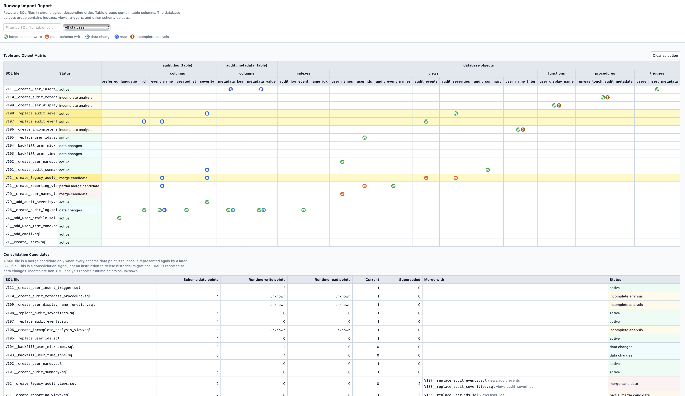

# Runway

Runway is a native-first, reflection-free database migration engine for Java applications.
It serves as an alternative to Flyway which uses runtime reflection.
Runway also provides migration impact report to help consolidate and clean-up large migration histories.



`runway-codegen` compiles migration files into generated Java metadata and one generated UTF-8 resource per SQL statement.
Runtime migration execution does not scan for files or parse SQL.

```java
MigrationResult result = Runway.migrate(
    dataSource,
    io.github.absketches.runway.databases.postgresql.PostgreSqlDialect.INSTANCE,
    GeneratedRunwayMigrations.registry()
);
```

Dialects are explicit Java objects. Runway does not inspect drivers, scan the classpath or discover implementations dynamically.
That same model supports multiple dialects for one database family: add another `DatabaseDialect` implementation and pass it directly,
for example a future `MySql8Dialect.INSTANCE`.

## Modules

- `runway-core`: API, planner, resource-backed JDBC runtime, PostgreSQL, MySQL, MariaDB and SQLite dialects.
- `runway-codegen`: standalone SQL compiler that generates statement resources and optional impact reports.
- `runway-integration-tests`: consumer-style SQLite integration tests.

### Package Structure

`runway-codegen` keeps CLI orchestration in `codegen`, SQL preparation in `codegen.sql`, migration-file metadata in
`codegen.migration`, optional impact analysis in `codegen.analysis`, and generated artifacts in `codegen.output`.

`runway-core` keeps its consumer API in `runway`, migration ordering and validation in `runway.planning`, history-table
persistence in `runway.history`, and database-specific behavior in `runway.databases.<database>`.

## Consumer Setup

Applications use Runway in two phases:

1. Build time: run `runway-codegen` against SQL files and add the generated Java sources and resources to the build.
2. Runtime: configure your own `DataSource` and call `Runway.migrate(...)` with the matching dialect and generated registry.

Runway does not read JDBC URL, username or password properties. The consuming application owns database configuration
and passes a ready `DataSource` to Runway.

### Maven

Add `runway-core` as an application dependency. Use `runway-codegen` from the build only. Add your JDBC driver and
DataSource library the same way you normally would for the application.

```xml
<properties>
    <runway.core.version>REPLACE_WITH_RUNWAY_CORE_VERSION</runway.core.version>
    <runway.codegen.version>REPLACE_WITH_RUNWAY_CODEGEN_VERSION</runway.codegen.version>
</properties>

<dependencies>
    <dependency>
        <groupId>io.github.absketches</groupId>
        <artifactId>runway-core</artifactId>
        <version>${runway.core.version}</version>
    </dependency>
</dependencies>
```

Generate migrations during `generate-sources` and add generated sources/resources to the application build:

```xml
<build>
    <plugins>
        <plugin>
            <groupId>org.codehaus.mojo</groupId>
            <artifactId>exec-maven-plugin</artifactId>
            <version>3.3.0</version>
            <executions>
                <execution>
                    <id>generate-runway-migrations</id>
                    <phase>generate-sources</phase>
                    <goals>
                        <goal>java</goal>
                    </goals>
                    <configuration>
                        <mainClass>io.github.absketches.runway.codegen.RunwayCodegen</mainClass>
                        <includePluginDependencies>true</includePluginDependencies>
                        <arguments>
                            <argument>--input</argument>
                            <argument>${project.basedir}/src/main/runway</argument>
                            <argument>--output</argument>
                            <argument>${project.build.directory}/generated-sources/runway/main/java</argument>
                            <argument>--resource-output</argument>
                            <argument>${project.build.directory}/generated-resources/runway/main</argument>
                            <argument>--package</argument>
                            <argument>com.example.generated.runway</argument>
                            <argument>--class-name</argument>
                            <argument>GeneratedRunwayMigrations</argument>
                            <argument>--dialect</argument>
                            <argument>postgresql</argument>
                        </arguments>
                    </configuration>
                </execution>
            </executions>
            <dependencies>
                <dependency>
                    <groupId>io.github.absketches</groupId>
                    <artifactId>runway-codegen</artifactId>
                    <version>${runway.codegen.version}</version>
                </dependency>
            </dependencies>
        </plugin>

        <plugin>
            <groupId>org.codehaus.mojo</groupId>
            <artifactId>build-helper-maven-plugin</artifactId>
            <version>3.6.0</version>
            <executions>
                <execution>
                    <id>add-runway-sources</id>
                    <phase>generate-sources</phase>
                    <goals>
                        <goal>add-source</goal>
                    </goals>
                    <configuration>
                        <sources>
                            <source>${project.build.directory}/generated-sources/runway/main/java</source>
                        </sources>
                    </configuration>
                </execution>
                <execution>
                    <id>add-runway-resources</id>
                    <phase>generate-resources</phase>
                    <goals>
                        <goal>add-resource</goal>
                    </goals>
                    <configuration>
                        <resources>
                            <resource>
                                <directory>${project.build.directory}/generated-resources/runway/main</directory>
                            </resource>
                        </resources>
                    </configuration>
                </execution>
            </executions>
        </plugin>
    </plugins>
</build>
```

### Gradle

For Gradle Kotlin DSL, keep codegen on a build-only configuration and wire generated output into `main`:

```kotlin
plugins {
    java
}

val runwayCoreVersion = "REPLACE_WITH_RUNWAY_CORE_VERSION"
val runwayCodegenVersion = "REPLACE_WITH_RUNWAY_CODEGEN_VERSION"

val runwayCodegen by configurations.creating

dependencies {
    implementation("io.github.absketches:runway-core:$runwayCoreVersion")
    runwayCodegen("io.github.absketches:runway-codegen:$runwayCodegenVersion")
}

val runwayGeneratedSources = layout.buildDirectory.dir("generated/sources/runway/main/java")
val runwayGeneratedResources = layout.buildDirectory.dir("generated/resources/runway/main")

tasks.register<JavaExec>("generateRunwayMigrations") {
    classpath = runwayCodegen
    mainClass.set("io.github.absketches.runway.codegen.RunwayCodegen")
    args(
        "--input", layout.projectDirectory.dir("src/main/runway").asFile.absolutePath,
        "--output", runwayGeneratedSources.get().asFile.absolutePath,
        "--resource-output", runwayGeneratedResources.get().asFile.absolutePath,
        "--package", "com.example.generated.runway",
        "--class-name", "GeneratedRunwayMigrations",
        "--dialect", "postgresql"
    )
}

sourceSets {
    main {
        java.srcDir(runwayGeneratedSources)
        resources.srcDir(runwayGeneratedResources)
    }
}

tasks.named("compileJava") {
    dependsOn("generateRunwayMigrations")
}

tasks.named("processResources") {
    dependsOn("generateRunwayMigrations")
}
```
### Alternate way to use runway-codegen without wiring

```bash
java -cp runway-codegen/target/runway-codegen-<version>.jar \
  io.github.absketches.runway.codegen.RunwayCodegen \
  --input src/main/runway \
  --output build/generated/sources/runway/main/java \
  --resource-output build/generated/resources/runway/main \
  --package io.github.absketches.runway.generated \
  --class-name GeneratedRunwayMigrations \
  --dialect postgresql \
  --impact-output build/reports/runway/impact.html
```

Use --help to print the supported command-line options.
```bash
java -cp runway-codegen/target/runway-codegen-<version>.jar \
io.github.absketches.runway.codegen.RunwayCodegen --help
```

### Runtime

Use the same database family at runtime that was used for `--dialect` during codegen. Generated registries record the
codegen dialect, and Runway throws a `MigrationException` if the runtime `DatabaseDialect` does not match.

```java
import com.example.generated.runway.GeneratedRunwayMigrations;
import io.github.absketches.runway.MigrationResult;
import io.github.absketches.runway.Runway;
import io.github.absketches.runway.databases.postgresql.PostgreSqlDialect;

import javax.sql.DataSource;

final class DatabaseStartup {
    void migrate(DataSource dataSource) {
        MigrationResult result = Runway.migrate(
            dataSource,
            PostgreSqlDialect.INSTANCE,
            GeneratedRunwayMigrations.registry()
        );

        if (!result.success()) {
            throw new IllegalStateException("Runway migration validation failed: " + result.validationErrors());
        }
    }
}
```

These dialects are supported at the moment:

- `postgresql`
- `mysql`
- `mariadb`
- `sqlite`

Codegen splits files into ordered statement resources. Core receives only their ordered resource paths; impact metadata is
not generated into runtime classes. Supplying `--impact-output` runs impact analysis, emits a standalone HTML report with
sticky headers, search, status filtering, and a table/column matrix with SQL files in chronological descending order, and
prints the generated report path to the console. The report includes a `database objects` group for indexes, views, and
other schema objects. A file is marked as a `merge candidate` only when every schema data point it touches is represented
again by a later SQL file. This is a consolidation signal, not an instruction to delete historical migrations. DML and
incomplete non-DML analysis are reported separately; incomplete analysis takes precedence when a file contains both. The
consolidation table lists the later file and schema point that supersede each older schema write.

**Procedure and function definitions will be applied on the database but their analysis is currently not supported and will be marked as incomplete**

Codegen handles MySQL/MariaDB `DELIMITER` directives while splitting and removes them from generated JDBC statements.
Statements outside impact-analysis coverage remain executable and are reported as unknown or incomplete when analysis is enabled.
Codegen also emits catalog-specific GraalVM reachability metadata under a Runway-owned native-image path, so generated SQL
resources are included in native images without replacing other native-image metadata.

#### Rules for SQL file names

- Must start with uppercase V
- Version must be numeric parts only
- Version parts may be separated by ., _, or -
- Must use exactly double underscore __ between version and description
- Description must start with a letter or digit
- Description may contain letters, digits, underscores, spaces, and hyphens

Supported example file name conventions:

- `V1__create_users.sql`
- `V111__create_users.sql`
- `V2026.06.16__create_users.sql`
- `V1_2__add_email.sql`
- `V1-2__add-email.sql`
- `V001__create_users.sql`

## Build

```bash
mvn verify
```

## Releases

Published artifacts:

- `io.github.absketches:runway-core`
- `io.github.absketches:runway-codegen`

`runway-integration-tests` is marked with `maven.deploy.skip=true` and is never published.

The parent POM is a private build parent for this repository and is not published. `runway-core` and `runway-codegen`
carry explicit module versions and are released independently. Their published POMs are flattened so consumers only need
the artifact they use, not `runway-parent`.
